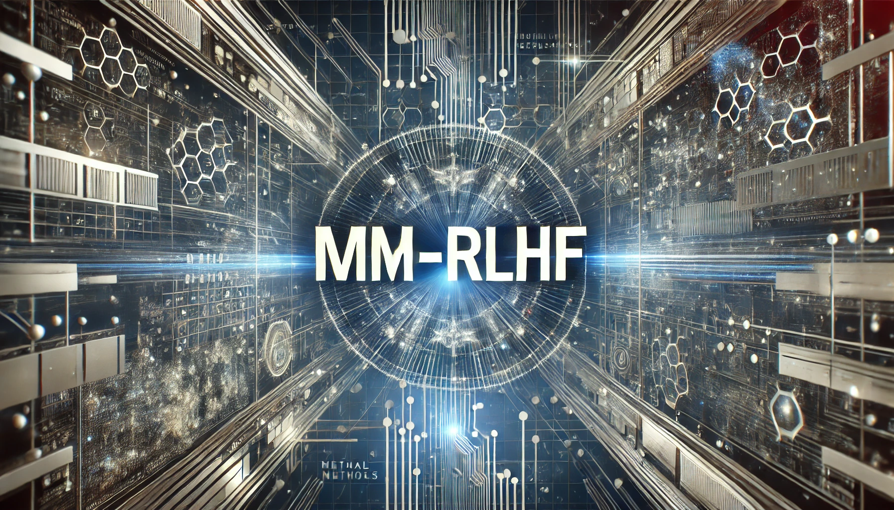

<p align="center" width="100%">

</p>

<font size=7><div align='center' >  
[[📖 arXiv Paper](https://arxiv.org/abs/2502.10391)] 
[[📊 MM-RLHF Data](https://huggingface.co/datasets/yifanzhang114/MM-RLHF)] 
[[📝 Homepage](https://mm-rlhf.github.io/)] 

[[🏆 Reward Model](https://huggingface.co/yifanzhang114/MM-RLHF-Reward-7B-llava-ov-qwen)] 
[[🔮 MM-RewardBench](https://huggingface.co/datasets/yifanzhang114/MM-RLHF-RewardBench)] 
[[🔮 MM-SafetyBench](https://github.com/yfzhang114/mmrlhf-eval)] 
[[📈 Evaluation Suite](https://github.com/yfzhang114/mmrlhf-eval)] 
</div></font>

# The Evaluation Suite of Large Multimodal Models 

Welcome to the docs for `mmrlhf-eval`: the evaluation suite for the [MM-RLHF](https://github.com/yfzhang114/MM-RLHF) project.

---

## Annoucement

- [2025-03] 📝📝 This project is built upon the lmms_eval framework. We have established a dedicated *"Hallucination and Safety Tasks"* category, incorporating three key benchmarks - *AMBER, MMHal-Bench, and ObjectHallusion.* **Additionally, we introduce our novel MM-RLHF-SafetyBench task, a comprehensive safety evaluation protocol specifically designed for MLLM.** Detailed specifications of the MM-RLHF-SafetyBench are documented in [current_tasks](docs/current_tasks.md).

## Installation

For development, you can install the package by cloning the repository and running the following command:
```bash
git clone https://github.com/EvolvingLMMs-Lab/lmms-eval
cd lmms-eval
pip install -e .
```

If you want to test LLaVA, you will have to clone their repo from [LLaVA](https://github.com/haotian-liu/LLaVA) and
```bash
# for llava 1.5
# git clone https://github.com/haotian-liu/LLaVA
# cd LLaVA
# pip install -e .

# for llava-next (1.6)
git clone https://github.com/LLaVA-VL/LLaVA-NeXT
cd LLaVA-NeXT
pip install -e .
```

## Evaluation and Safety Benchmark

### AMBER Dataset

To run evaluations for the **AMBER dataset**, you need to download the image data from the following link and place it in the `lmms_eval/tasks/amber` folder:

[AMBER dataset image download](https://drive.google.com/file/d/1MaCHgtupcZUjf007anNl4_MV0o4DjXvl/view?usp=sharing)

Once the image data is downloaded and placed in the correct folder, you can proceed with evaluating AMBER-based tasks.

### CHIAR Metric for Object Hallucination and AMBER

For benchmarks that require the calculation of the **CHIAR metric** (such as **Object Hallucination** and **AMBER**), you'll need to install and configure the required Natural Language Toolkit (NLTK) resources. Run the following commands to download necessary NLTK data:

```bash
python3 - <<EOF
import nltk
nltk.download('punkt_tab')
nltk.download('wordnet')
nltk.download('averaged_perceptron_tagger_eng')
EOF
```

### Safety Benchmarks Evaluation
For Safety-related benchmarks (e.g., MM-RLHF-Safety), here is an example of how to run the evaluations using the Qwen2VL model. Follow the sequence of commands below to evaluate the model on various safety tasks:

```bash
python3 -m accelerate.commands.launch \
    --num_processes=4 \
    --main_process_port 12346 \
    -m lmms_eval \
    --model qwen2_vl \
    --model_args pretrained="Qwen/Qwen2-VL-7B-Instruct" \
    --tasks Safe_unsafes,Unsafes,Risk_identification,Adv_target,Adv_untarget,Typographic_ASR,Typographic_RtA \
    --batch_size 1 \


python3 -m accelerate.commands.launch \
    --num_processes=4 \
    --main_process_port 12346 \
    -m lmms_eval \
    --model qwen2_vl \
    --model_args pretrained="Qwen/Qwen2-VL-7B-Instruct" \
    --tasks Multimodel_ASR,Multimodel_RtA \
    --batch_size 1 \

python3 -m accelerate.commands.launch \
    --num_processes=4 \
    --main_process_port 12346 \
    -m lmms_eval \
    --model qwen2_vl \
    --model_args pretrained="Qwen/Qwen2-VL-7B-Instruct" \
    --tasks Crossmodel_ASR,Crossmodel_RtA \
    --batch_size 1 \
```

## Add Customized Model and Dataset

Please refer to our [documentation](docs/README.md).

---

## Citations

```shell
@article{zhang2024mme,
    title={MME-RealWorld: Could Your Multimodal LLM Challenge High-Resolution Real-World Scenarios that are Difficult for Humans?},
    author={Zhang, Yi-Fan and Zhang, Huanyu and Tian, Haochen and Fu, Chaoyou and Zhang, Shuangqing and Wu, Junfei and Li, Feng and Wang, Kun and Wen, Qingsong and Zhang, Zhang and others},
    journal={arXiv preprint arXiv:2408.13257},
    year={2024}
}      
```
